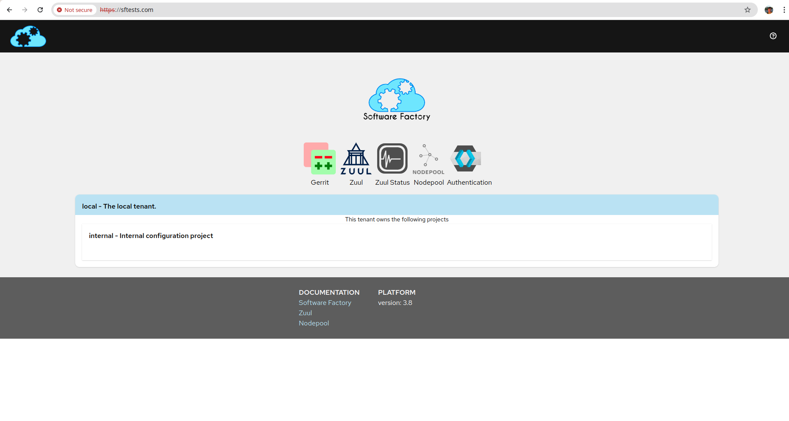
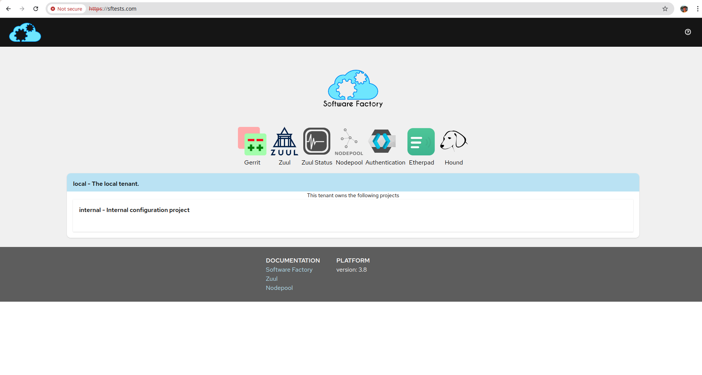

# [Openinfra Summit Asia 2024](https://2024.openinfraasia.org/) - Settle your CI environment with the Software Factory

This repository contains supplementary materials for our presentation at the OpenInfra Summit Asia 2024.

You can access to the Presentation Slides [here](./sf-openinfra-asia-2024-presentation-slides.pdf).

## Abstract

When you are about to start a new project or a software company/startup, there are a lot of baselines to prepare. Where to keep your code, what tool to use for testing that code and how to monitor all this? In this presentation, we would like to present to you the Software Factory – a solution, that provides all you need for starting such work, including Gerrit, Zuul, Grafana and many more, all with convenient configuration-as-code.

## Useful Links

### Software Factory

- [Software Factory](https://softwarefactory-project.io/docs/)
- [Software Factory - Minimal quickstart](https://docs.softwarefactory-project.io/sf-config-3.8/operator/quickstart.html) - Useful for deploying on CentOS 7 / 8.
- [sfconfig - Software Factory Configuration Management](https://github.com/softwarefactory-project/sf-config/) - Useful for deploying on RHEL / CentOS 9.
- [Future SF-Operator](https://github.com/softwarefactory-project/sf-operator)

## Demo - Deployment

We provide an automated deployment example using Vagrant for CentOS 7, with libvirt as the virtualization provider. The setup is handled via RPM packages and the deployment is totally automated.

### Requirements

Before proceeding with the deployment on a VM, make sure the following tools are installed:

- [Install Vagrant](https://developer.hashicorp.com/vagrant/docs/installation)
- [Vagrant provider for libvirt](https://github.com/vagrant-libvirt/vagrant-libvirt)

### Deployment

- Centos 7 - Via RPM package

```bash
cd Centos7-deployment/
vagrant up
```

Once deployed, we will be able to see the VM in the global status area:

```bash
vagrant global-status 

id       name               provider state   directory                               
-------------------------------------------------------------------------------------
7dd2891  sftests.com libvirt running /home/afuscoar/openinfra_asia_2024/Centos9-deployment/ 
```

We should add the IP in our `/etc/hosts` file to resolve the VM IP:

```bash
vagrant ssh -c "hostname -I | awk '{print \$1}'"

192.168.121.21

sudo echo "192.168.121.21 sftests.com" >> /etc/hosts
```

If we access to [https://sftests.com/](https://sftests.com/) in our host we will be able to see Software Factory :)




### Software Factory architecture

We can find more information about the different services integrated in Software factory in the [Operator documentation > Architecture entry](https://softwarefactory-project.io/docs/operator/architecture.html#configuration).

In the previous deployment we have configured the minimal architecture that includes the following components:

```bash
# Checking inside the VM...
[root@managesf.sftests.com vagrant]# cat /etc/software-factory/arch.yaml 
---
description: "Minimal Software Factory deployment"
inventory:
  - name: managesf
    roles:
      - install-server
      - mysql
      - zookeeper
      - gateway
      - keycloak
      - firehose
      - gerrit
      - managesf
      - logserver
      - zuul-scheduler
      - zuul-executor
      - zuul-web
      - nodepool-launcher
```

In case of extra components, we can add them in the `arch.yaml` file and execute the `sfconfig` command again that will load the roles and execute them via ansible. Let's add some of them optional components into the inventory roles list:

```bash
[root@managesf.sftests.com vagrant]# cat /etc/software-factory/arch.yaml 
---
description: "Minimal Software Factory deployment"
inventory:
  - name: managesf
    roles:
      - install-server
      - mysql
      - zookeeper
      - gateway
      - keycloak
      - firehose
      - gerrit
      - managesf
      - logserver
      - zuul-scheduler
      - zuul-executor
      - zuul-web
      - nodepool-launcher
      - etherpad
      - hound
```

Let's execute the `sfconfig` command:

```bash
[root@managesf.sftests.com vagrant]# sfconfig 

[Wed Aug 28 15:17:46 2024] Running sfconfig
Keycloak replaces Cauth starting from release 3.8. The arch file will be modified accordingly.
[+] Wrote /var/lib/software-factory/ansible/hosts
[+] Wrote /var/lib/software-factory/ansible/config_update.yml
[+] Wrote /var/lib/software-factory/ansible/get_logs.yml
[+] Wrote /var/lib/software-factory/ansible/sf_backup.yml
[+] Wrote /var/lib/software-factory/ansible/sf_erase.yml
[+] Wrote /etc/hosts

Running with the following inventory:

[{'name': 'managesf', 'roles': ['install-server', 'mysql', 'zookeeper', 'gateway', 'keycloak', 'firehose', 'gerrit', 'managesf', 'logserver', 'zuul-scheduler', 'zuul-executor', 'zuul-web', 'nodepool-launcher', 'etherpad', 'hound'], 'hostname': 'managesf.sftests.com', 'ip': '192.168.121.21', 'public_url': 'https://sftests.com'}]
...
```

We will see that it will start the execution of the playbook and we can see the new components we added: `etherpad` and `hound`. Once the images with the services are pulled and they are configured and running, we will be able to see them via [https://sftests.com/](https://sftests.com/).





## Authors

Szymon Datko, Adrian Fusco Arnejo
